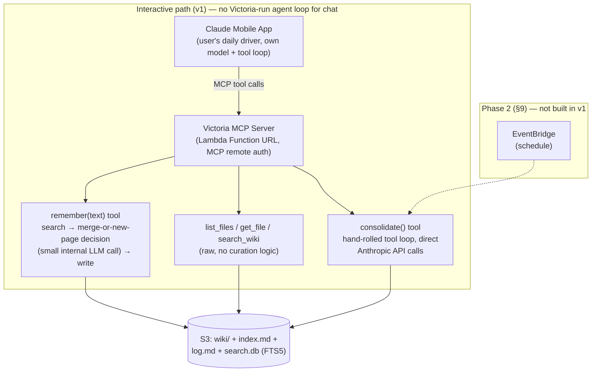

# Personal Admin Agent — Design

## 1. Goal

A learning project: a hosted, always-available agent that acts as admin for two
domains — **house** (tool inventory, "can I do this project," manuals) and
**business/LLC** (tax categories, hours worked, filings). Available from anywhere
(phone, browser, wherever), and low cost is a hard constraint throughout.

## 2. Architecture overview



Two different places run "agent" reasoning against the same shared wiki:

- **Interactive path**: the user's Claude mobile app *is* the agent — it already
  has its own tool-use loop and model, the same way it already drives the user's
  wine-fridge MCP server. Victoria just exposes the wiki over MCP; there is no
  separate Victoria-run loop for chat. Read tools are raw and unopinionated
  (low-stakes — a bad multi-step retrieval just yields a slightly worse answer).
  The one write tool, `remember`, is curation-aware *in its implementation* —
  search-before-write and schema conformance are enforced server-side, not left
  to the calling model's judgment, since MCP instructions/tool descriptions are
  advisory and easy for a generic long-running chat session to drift from. See
  §7 for what runs inside `remember`.
- **Consolidate**: has its own full hand-rolled tool-calling loop against the
  Anthropic API (§9, §10), since it needs multi-step cross-page reasoning no
  single tool call can do inline. In v1 it's still reached through the
  interactive path — an MCP tool (`consolidate`) the user calls on demand —
  not a standing scheduled job. EventBridge-driven automation is phase 2
  only, once on-demand proves insufficient (§9, §15).

Both paths read and write the same S3 bucket — one wiki, not two systems (see
also `USE_CASES.md`, which makes the same point about the house/business split
being a namespacing convention, not separate storage).

## 3. Memory architecture — LLM wiki pattern (not RAG / vector DB)

Instead of embeddings + vector search, the agent maintains a hand-curated markdown
wiki. Synthesis happens once, at ingest time, and is reused on every later query —
cheaper and simpler than re-deriving answers from raw documents each time, and
appropriate at the expected scale (low hundreds of pages).

Structure:
- `raw/` — source documents, untouched (text notes/messages only in v1 — see §8)
- `wiki/` — LLM-maintained markdown pages, split into two sections:
  - `wiki/house/`
  - `wiki/business/`
- `index.md` — table of contents / catalog of wiki pages
- `log.md` — append-only audit trail of what the agent did and when
- `search.db` — SQLite/FTS5 sidecar full-text index (see §6)
- `CONVENTIONS.md` — schema/conventions file (CLAUDE.md-style) defining page
  format and linking rules; drafted at `seed/CONVENTIONS.md` (§14) pending
  upload to the wiki root alongside `index.md`/`log.md`

Three agent operations:
- **Ingest** — file new information into the wiki (the primary use case: "remember
  this")
- **Query** — answer a question from the existing wiki
- **Consolidate** — periodic pass to catch contradictions, stale claims, orphan pages

## 4. Infra: Lambda + S3

- **S3** holds the entire wiki. Versioning enabled — gives history/rollback without
  needing git.
- **Lambda** is the stateless compute layer: on each invocation, reads relevant
  pages from S3, calls the LLM (when needed — see §9), writes updates back to S3.
- **Trigger (v1)**: a single **Lambda Function URL** serving as the **MCP
  server endpoint** for Claude mobile app — auth is MCP remote-server auth, not
  URL-layer `AuthType: NONE` (see §5). No EventBridge in v1 — see §9 on why
  consolidate is an on-demand tool instead of a cron job for now.
- **Storage — why S3 and not DynamoDB or EFS**:
  - **EFS** would be the literal "real filesystem" answer, but it needs a VPC,
    mount targets per AZ, and security groups to attach to Lambda — real
    operational overhead for a dataset that's a few hundred KB of markdown.
    Rejected as disproportionate.
  - **DynamoDB** offers single-digit-ms reads, but that advantage is invisible
    next to the multi-second LLM calls that dominate response time on any path
    that reasons (same "runtime overhead is noise next to LLM latency" logic as
    §10). It would also cost the free versioning/rollback S3 gives for nothing
    (§3) — DynamoDB history would need to be hand-rolled via streams. Rejected.
  - **Chosen: S3**, unchanged from the original design. The one place real
    filesystem semantics are actually needed — SQLite requires real file I/O —
    is already handled by pulling `search.db` into Lambda's `/tmp` per
    invocation (§6); everything else stays on durable, versioned, effectively-free
    S3 storage.
- **Cost**: Lambda free tier (1M requests / 400,000 GB-seconds per month) plus
  pennies of S3 storage covers this at personal scale. Moving the interactive
  path onto Claude mobile app (§2) also moves most interactive-path LLM cost off
  Victoria's own API bill and onto the user's existing Claude subscription — the
  remaining direct API cost driver is the on-demand consolidate tool (§9) plus the
  internal merge-decision call inside `remember` (§7).
- **No GPU in Lambda**, confirmed as of 2026 (Firecracker excludes hardware
  accelerators even on the newer Managed Instances tier). Local LLM inference is
  not viable inside Lambda — it would require a separate always-on host (home
  machine or cheap VPS) reached through a tunnel (Tailscale/Cloudflare). **Out of
  scope for v1** — start with the Claude API only.

## 5. Interaction channel & auth: MCP server for Claude mobile app

- v1's interactive surface is Victoria acting as a **remote MCP server** that
  the user's Claude mobile app connects to as a custom connector — the same
  general pattern as the user's existing wine-fridge MCP server, but a
  different auth mechanism, chosen deliberately after reading that server's
  actual implementation.
- **Auth: `static_headers`** — one of Claude's supported custom-connector auth
  types (per Anthropic's connector-auth docs, checked directly rather than
  assumed): a fixed API key/bearer token, entered once when the connector is
  added in Claude mobile app, sent as a request header on every MCP call.
  - **Why not the wine-fridge's pattern**: that server uses full OAuth 2.1
    (`mcp-handler`'s `withMcpAuth`, PKCE, `.well-known/oauth-protected-resource`)
    with **Supabase Auth as the Authorization Server** — but it makes sense
    there because that project already runs Supabase Auth for its own
    multi-user web app, so reusing it for MCP is nearly free. Victoria has no
    existing identity provider and no multi-tenancy to design for; standing up
    an Authorization Server (e.g. Cognito) from scratch just to gate one
    person's traffic would be real infra for no real benefit — against the
    same cost/complexity principle that's driven every other choice here
    (§4, §12).
  - `static_headers` is in beta as of this writing — a small risk noted, not a
    blocker, given the low cost of switching later on a solo project.
  - Victoria's Lambda handler checks the incoming bearer token against the
    SSM-stored value on each request — no OAuth flow, no
    `.well-known/oauth-protected-resource` endpoint, no Authorization Server
    to run.
  - Scope the MCP server credential to this user only — there's no
    multi-tenant concern to design for.
- This closes the earlier gap where an unauthenticated public endpoint holding
  home-inventory and LLC/tax data was a real cost and privacy risk.
- Secrets (MCP auth credential, Anthropic API key) live in **SSM Parameter
  Store** (SecureString, KMS-encrypted) — free tier, unlike Secrets Manager's
  per-secret cost. Fetched via `aws-lambda-powertools`, which caches them for
  the life of the execution environment.

## 6. Search — S3 has no native full-text search

S3 offers no cross-object full-text search (S3 Select only queries *within* a
single object). Considered:
- **OpenSearch Serverless** — real full-text/semantic search, but even 2026's
  "NextGen" scale-to-zero pricing is more infra/cost than a single-user personal
  tool needs — rejected for v1.
- **DynamoDB with keyword tags** — cheap but not true full-text; weaker retrieval.
- **Chosen: SQLite + FTS5 sidecar index** (`search.db`), stored in S3, pulled into
  Lambda's `/tmp` (ephemeral storage) per invocation, queried, and re-uploaded on
  change. Essentially free (just Lambda execution time + trivial S3 storage),
  real full-text search, no separate service to operate.
- This is why `search_wiki` exists as a tool (§7) — without it, finding "which
  existing pages does this new fact touch" would mean listing and reading
  everything, which gets expensive and unreliable as the wiki grows. This was the
  main gap identified in review; a real search tool is what actually preserves
  the wiki pattern's "synthesize once, reuse cheaply" value as it scales.
- **Concurrency**: re-upload `search.db` and `index.md` with S3 conditional writes
  (`If-Match` on ETag) so a lost update (e.g. a scheduled ingest and an
  interactive query racing) fails loudly instead of silently corrupting state. A
  full lock (e.g. DynamoDB mutex) is a documented future upgrade, not required at
  solo-user request volume.

## 7. Agent tools (v1 surface)

All operate against the S3 wiki bucket, but the read/write split matters (§2):

- **Read tools — raw, exposed directly over MCP, no server-side curation
  logic**:
  - `list_files` — list wiki pages / raw sources
  - `get_file` — read a page
  - `search_wiki` — full-text query against the FTS5 sidecar index; returns
    matching page paths + snippets
  - Left raw because generic agentic retrieval (search → read → reason) is
    something Claude mobile app is already good at, and a suboptimal read just
    costs a slightly worse answer, not corrupted state.
- **Write tool — collapsed into one curation-aware tool**:
  - `remember(text)` — the only externally-exposed write surface. Internally:
    1. `search_wiki` against the new text to find related existing pages
    2. decide merge-into-existing-page vs. create-new-page (may use a small
       internal LLM call for this decision — this is where §9's old
       "cheap model for routine filing" idea now lives)
    3. apply the schema/conventions file (page format, linking rules)
    4. `put_file` the result, then update `index.md` and `search.db`
    5. return a short summary to the caller — page path, merged-vs-new — so
       the user can sanity-check what got filed, from their phone
  - `put_file` still exists as an internal primitive `remember` uses — it is
    **not** exposed directly to the calling model. Raw `put_file` was
    considered and rejected: a generic long-running chat session can't be
    relied on to search-before-write or follow the schema every time, and
    MCP's instructions/tool-description mechanism is advisory only, not
    enforced. Pushing curation into the tool's implementation makes correctness
    independent of which model happens to be driving the chat session that day.
- **Maintenance tool**:
  - `consolidate()` — triggers the consolidation pass (§9, §10) on demand: catches
    contradictions, stale claims, orphan pages. v1 is on-demand only, invoked
    from Claude mobile app when the user thinks to ask; see §9 for the
    phase-2 EventBridge automation path.
- **Structured outputs**: every tool returns a Pydantic model
  (`core/storage/models.py`, `core/operations/models.py`) — the mcp SDK uses
  a `BaseModel` return type directly as the tool's output schema and
  validates whatever's returned against it, rather than falling back to its
  generic `{"result": ...}` wrapper for bare types. File paths are a
  `WikiPath` type (`Annotated[str, StringConstraints(pattern=...)]`)
  validated against this section's own `wiki/(house|business)/**/*.md` (or
  root-file) convention — enforced, not just documented. No shared
  `results:` envelope across tools: each tool's fields are already
  distinctly named, and success/failure is MCP's own `CallToolResult`
  concern, not something to duplicate at the app level.

## 8. Scope narrowing — text only for v1

`raw/` ingestion in v1 is **text only** (typed notes / chat messages via
`remember`). Photos, PDFs, OCR, and vision-model processing are explicitly
deferred — no image/file pipeline is designed yet. Revisit once the text-only
flow is working end to end.

## 9. Agent shape: where Victoria still reasons for itself

Not "one agent, two modes" anymore — the interactive agent loop is now Claude
mobile app's, not Victoria's (§2). Victoria runs its own reasoning in two
narrower places:

1. **`remember` tool internals** (§7) — small, mostly-deterministic curation
   logic, with at most one internal LLM call for the merge-vs-new-page
   decision. Cheap/fast model (Haiku-class) — routine filing doesn't need a
   frontier model.
2. **Consolidate** — a full standalone hand-rolled tool-calling loop (§10), using a
   stronger model (Sonnet-class) since catching contradictions/stale claims
   across pages needs real cross-page synthesis.
   - **v1: on-demand MCP tool** (`consolidate`), invoked interactively when the
     user thinks to ask ("check the wiki for problems"). Same implementation
     either way; this just avoids standing up a second, unattended trigger
     path before it's clear the wiki actually drifts enough to need it.
   - **Phase 2: EventBridge schedule**, once solo usage has shown consolidate needs
     to run unattended rather than on-demand. Cheap to add later (a Terraform
     rule pointed at the same consolidate implementation) — deferred, not designed
     around, since on-demand-only is the simpler v1 default and EventBridge
     itself costs nothing either way.

There is no more "interactive path → catalog or query mode" routing in the
Lambda handler. In v1 the handler only has one trigger: an MCP tool-call
request → dispatch directly to the requested tool, including `consolidate` (§7,
§10). EventBridge routing is a phase-2 addition when the schedule shows up.

## 10. Implementation approach for the consolidate loop

The hand-rolled agent loop described here now applies to **`consolidate` only**
(v1: invoked on demand; phase 2: also EventBridge-triggered, §9) — the
interactive path no longer needs a Victoria-run loop at all, since Claude
mobile app's own loop drives interactive tool calls (§2, §9).

- **Skip heavy frameworks** (LangChain, LlamaIndex) — their dependency trees add
  measurable Lambda cold-start overhead (~250–450ms in benchmarks) and add
  abstraction that isn't needed for a small, single-purpose loop.
- **Recommended**: hand-roll the tool loop directly against the Anthropic Messages
  API — send a message, catch `tool_use` blocks, dispatch to `list_files` /
  `get_file` / `search_wiki` / `put_file`, feed `tool_result` back in, loop
  until the model stops calling tools. Full transparency into what's happening,
  minimal dependencies. The same loop shape backs the internal merge-decision
  call inside `remember` (§7), just invoked for a single decision rather than a
  full sweep.
- **Worth knowing about**: AWS Strands Agents SDK — purpose-built for
  Lambda/Fargate/EC2, addresses the "too much plumbing" complaint if hand-rolling
  gets tedious later.
- **Language/runtime: Python, for the whole Lambda, no SnapStart.** For
  `consolidate` and `remember`'s internal call, this was never in question — the
  LLM call itself takes 1–5+ seconds, dwarfing any runtime's cold start.
  - For the raw read tools (`list_files`, `get_file`, `search_wiki`, §7),
    which never call the LLM, cold start *is* a bigger fraction of what the
    user waits on during an interactive turn — but two mitigations were
    considered and rejected for v1, not designed around:
    - **A Go/Rust rewrite of just the MCP-facing layer, keeping `core/` in
      Python, does not work as a same-process optimization** — a Lambda runs
      one runtime, so a Go handler cannot call Python functions in-process.
      The only way to get a real win is either (a) two Lambdas — a Go
      dispatcher invoking a Python worker — which reintroduces a
      cross-Lambda-invoke hop on every call, likely erasing the saving it was
      meant to produce; or (b) reimplementing the read-tool logic natively in
      Go so it runs in the dispatcher's own process, which means maintaining
      two copies of that logic long-term. Both Go and Rust do have official
      MCP SDKs (`modelcontextprotocol/go-sdk`, maintained with Google;
      `modelcontextprotocol/rust-sdk`, the `rmcp` crate), so this stays a real
      option if cold start is ever an actually-felt problem — the honest
      future split is **LLM-calling vs. not**, not `core/` vs `mcp/` as
      originally framed here. The `core/`/`mcp/` package boundary (§14) is
      still worth keeping for testability, just not as a language-swap
      shortcut.
    - **SnapStart** (GA for Python 3.12+, typically removes 70–90% of init
      latency) was considered and rejected for v1: its restore charge is
      negligible, but its caching charge (~$0.0000015046/GB-second, 3-hour
      minimum, billed continuously while cached) is *rent*, not
      usage-metered — the first cost in this design that isn't ~$0 at low
      personal usage (§4, §12). At solo low-frequency usage, prepaying ~$2–4/mo
      to avoid cold starts you weren't hitting much anyway isn't worth it.
  - **v1 default: plain Python, no SnapStart, no rewrite.** Revisit only if
    cold start turns out to be an actually-felt annoyance in daily use — not
    a hypothetical to build or pay against now.

## 11. Streaming — obsolete for v1

Originally designed for a bespoke Slack query UI (`InvokeMode: RESPONSE_STREAM`
+ streaming Anthropic's token stream through to Slack). That interactive UI no
longer exists — Claude mobile app's own chat UI handles the interactive
experience natively, including its own streaming. Nothing left for Victoria to
build here; keeping this section only as a note of what was dropped and why.

## 12. Cost-control principles (applies throughout)

- Model tiering: cheap model inside `remember`'s merge decision, strong model
  only for the consolidate job's cross-page reasoning (§9)
- Interactive-path LLM cost now mostly rides the user's existing Claude
  subscription rather than Victoria's own metered API tokens (§4) — the
  remaining direct API cost driver is the consolidate job plus `remember`'s
  internal call
- Prompt-cache the schema/conventions file — it's static context sent on every
  `remember` and consolidate-loop call
- No vector DB / embedding pipeline — the SQLite/FTS5 sidecar covers search at
  essentially zero cost instead
- No local LLM / GPU host for v1 — an always-on machine plus tunnel setup isn't
  justified until well past personal-admin usage volume
- SSM Parameter Store over Secrets Manager for secrets (free vs. per-secret cost)

## 13. Tech stack

- **Terraform** for all infra: S3 bucket (+ versioning), Lambda function, Lambda
  Function URL, SSM parameters (values set out-of-band, never committed), IAM
  role/policy (least privilege: scoped S3 bucket access, SSM read on specific
  parameter paths, CloudWatch Logs). EventBridge schedule rule is phase 2 (§9),
  not applied in v1. Applied manually (`terraform plan`/`apply` by hand) — no
  auto-deploy CI, since this is personal infra worth reviewing before it changes.
- **Language: Python, whole Lambda, no SnapStart.** One language across
  `core/` and `mcp/` (§14), better Anthropic-SDK ergonomics for
  `remember`/`consolidate`'s LLM calls, and — per §10 — no cheap partial-rewrite
  shortcut actually exists (a Lambda is one runtime; `mcp/` can't stay a thin
  Go adapter over a Python `core/`). Revisit only if cold start on the read
  tools is an actually-felt problem in practice; see §10 for what that
  revisit would really involve.
- **Python tooling**:
  - `uv` — dependency management (`pyproject.toml` + `uv.lock`); also used to
    build the Lambda deployment package
  - `ruff` — lint + format (replaces black/isort/flake8)
  - `pytest` + `moto` — unit tests with AWS services (S3/SSM/EventBridge) mocked,
    no real AWS calls needed to test
  - `aws-lambda-powertools` — structured logging, SSM parameter fetching with
    caching, event parsing
  - `mcp` — official Model Context Protocol Python SDK; MCP Python SDK v2 is
    the current stable line (GA 2026-07-28) — pin to whatever's current on
    PyPI at implementation time rather than assuming this version
  - `pre-commit` — runs `ruff check`, `ruff format --check`, `terraform fmt
    -check` before commit
- A lightweight GitHub Actions workflow for lint + `pytest` on push is a
  reasonable stretch addition later; not required for v1.

## 14. Repo layout

`core/` holds all business logic and has no MCP-specific types or imports —
it's plain Python functions over S3/SQLite/Anthropic, independently testable
on its own. `mcp/` is a thin adapter: it registers tools, translates MCP
tool-call requests into `core/` function calls, and formats the results back
as MCP responses. Nothing in `mcp/` is itself business logic. This split is
for testability and clarity, not — per §10 — a mechanism for cheaply swapping
`mcp/` to another language later; a real future rewrite would split along
LLM-calling vs. not, which cuts across this boundary rather than along it.

Within `core/`, three subpackages replace what was a flat file list once it
grew past a couple of files — grouped by role, not just by "everything
core":
- `storage/` — the persistence layer (S3 + the FTS5 sidecar)
- `integrations/` — external non-AWS APIs (currently just Anthropic; named
  for room to grow, not because a second integration is expected)
- `operations/` — the two agent operations DESIGN §3 names (Ingest/Consolidate),
  reusing that exact vocabulary so code and design doc stay traceable

```
victoria/
  docs/
    DESIGN.md
    USE_CASES.md
  seed/                      # wiki bootstrap content, uploaded to S3 root on setup
    CONVENTIONS.md           # schema/conventions file (§3) — page format, linking rules
    index.md                 # empty table-of-contents template
    log.md                   # empty audit-log template
  infra/                     # Terraform
    main.tf, lambda.tf, s3.tf, iam.tf, ssm.tf, variables.tf, outputs.tf
    # EventBridge is phase 2 (§9) — not applied in v1
  agent/                     # Python package (uv-managed)
    pyproject.toml
    uv.lock
    src/victoria/
      core/                       # business logic — no MCP types/imports
        config.py                 # cross-cutting settings, stays at core/ root
        storage/
          wiki.py                 # list_files, get_file, put_file primitives (S3)
          search_index.py         # SQLite/FTS5 sidecar management
        integrations/
          anthropic_client.py     # Anthropic SDK wrapper, model tiering (Haiku/Sonnet)
        operations/
          remember.py             # remember() curation logic (§7)
          consolidate.py          # consolidate() hand-rolled tool-calling loop (§10)
      mcp/                        # MCP protocol boundary only — thin adapter
        server.py                 # MCP server setup, tool registration, remote auth
        handlers.py               # MCP tool-call requests -> core/ calls -> MCP responses
      lambda_handler.py           # Lambda entrypoint: MCP HTTP events -> mcp/server
                                   # (phase 2: also routes EventBridge -> core/operations/consolidate.consolidate)
    tests/                        # mirrors src/victoria/ 1:1
      test_core/
        test_storage/
        test_integrations/
        test_operations/
      test_mcp/
  .pre-commit-config.yaml
```

## 15. Open questions

**Resolved:**

- ~~The schema/conventions file doesn't exist yet~~ — drafted at
  `seed/CONVENTIONS.md` (§14): frontmatter (`title`/`tags`/`last-updated`
  only, no rigid schema for things like due dates — those stay prose under a
  named heading), category-first pages that split into a directory once
  unwieldy (`remember` never splits on its own — it flags size in its return
  summary; splitting is a `consolidate` job), and plain relative markdown links
  (not `[[wiki-link]]` syntax, so any ordinary markdown viewer renders it).

- ~~Exact MCP remote-auth mechanism is unconfirmed~~ — resolved (§5):
  `static_headers` (a fixed bearer token checked against SSM on each request),
  not the wine-fridge server's OAuth-via-Supabase pattern, since Victoria has
  no existing identity provider to reuse and standing one up solely for
  single-user auth isn't justified.

Nothing is currently blocking — `infra/`, the read path, `remember`/`consolidate`'s
conventions, and now `mcp/server.py`'s auth can all proceed.

**Not blockers — decide during implementation:**

- Exact S3 bucket layout / key naming convention within `wiki/` and `raw/`
- When/whether to add a local-LLM compute path behind the same orchestrator later
- When to move from ETag-based conditional writes to a real lock, if concurrent
  usage ever grows beyond solo-user
- When/how to design the file/image ingestion pipeline (OCR, vision model) —
  deliberately deferred, not forgotten
- Whether/when phase 2's EventBridge consolidate trigger is actually needed — revisit
  once solo usage shows whether on-demand `consolidate` gets forgotten in practice

## 16. Build checklist

- [x] Write the schema/conventions file (`seed/CONVENTIONS.md`, §14) defining
      wiki page format and linking rules
- [x] `infra/`: S3 bucket (versioning on), SSM parameter resources, IAM role,
      Lambda function + Function URL — written in Terraform and
      `terraform validate` passes; **not yet applied** (needs real AWS
      credentials + a deliberate `terraform apply`, and the Lambda deployment
      package doesn't exist yet — see below)
- [x] `agent/`: `uv` project + `ruff` + `pre-commit` set up; `core/` vs `mcp/`
      package boundary scaffolded (§14)
- [x] `core/`: read primitives (`list_files`, `get_file`, `search_wiki`) +
      SQLite/FTS5 sidecar management, with conditional-write semantics (§6)
      verified against moto
- [x] `core/`: `put_file` internal primitive, `remember` (curation-aware
      write tool), and `consolidate` (hand-rolled tool-calling loop) (§7, §10)
- [x] `mcp/`: MCP server (tool exposure + `static_headers` bearer-token check
      against SSM, §5) as a thin adapter over `core/`, wired to a Lambda
      Function URL via Terraform (`mangum` bridges the ASGI app to Lambda)
- [x] `pytest`/`moto` tests for the S3 tools, search index, `remember`,
      `consolidate`, and the auth middleware — 24 tests passing
- [ ] **Build the Lambda deployment package** — `agent/scripts/build_lambda.sh`
      wraps Astral's uv + AWS Lambda recipe to resolve native-dependency
      packages (`pydantic-core`, `cryptography`) for Lambda's linux/arm64
      runtime from a macOS dev machine, no Docker needed; run it, then
      `terraform apply`, set the two SSM secret values, and add Victoria as
      a custom connector in Claude mobile app
- [ ] (Phase 2) `infra/`: EventBridge schedule for the periodic consolidate job (§9)
- [ ] (Later) design file/image ingestion pipeline
- [ ] (Later) if read-tool cold start is actually noticeable in daily use,
      revisit §10 — options are SnapStart (~$2–4/mo, no rewrite) or a native
      Go/Rust reimplementation of the read tools (free to run, real rewrite)
